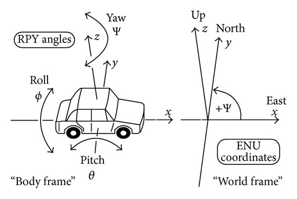
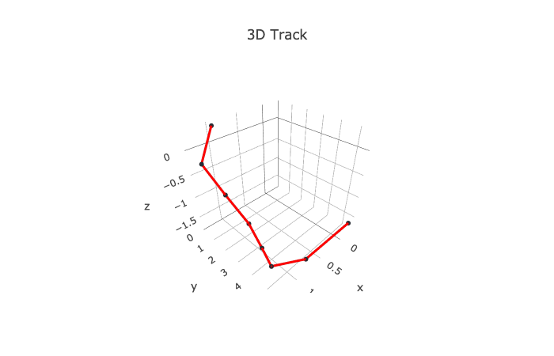

# Tracking-Software
*Arduino Tracking Software with BNO055*

The task was to develop a Software for Arduino to track the driven way of an vehicle without using GPS, because the vehicle is mostly driving underground.

## Parts you need
* Arduino Uno
* Adafruit BN055
* Catalex MicroSD Card Adapter
* Reed Switch

## Theory
With the BN055 we can measure the roll-pitch-yaw angle of the vehicle and with the Reed Switch when we traveled for example one meter (if you know the diameter of your wheels). Thanks to this information and the Pythagorean theorem we can now locate our robot, if we know/safed the starting point.



## Code

First we need to calibrate our Sensor 

```shell
Adafruit_BNO055 bno = Adafruit_BNO055();
imu::Vector<3> euler = bno.getVector(Adafruit_BNO055::VECTOR_EULER);
uint8_t system, gyro, accel, mag = 0;
bno.getCalibration(&system, &gyro, &accel, &mag);
```

Important for use is the value of the variable `mag`. If `mag` reaches the value 3 we are ready to go.

Now the calc starts. We measure every one meter the euler vector (degrees) to calculate the new position.

```shell
      position_z = position_z + sin((euler.y()*DEG_TO_RAD));
      hyp =  cos((euler.y()*DEG_TO_RAD));    
      
      if(euler.x()<=90){
      position_x = position_x + cos((euler.x()*DEG_TO_RAD)) * (-1) * hyp;
      position_y = position_y + sin((euler.x()*DEG_TO_RAD)) * hyp;
      }

      else if(euler.x() > 90 && euler.x() <=180){
      winkel = 180 - euler.x();
      position_x = position_x + cos((winkel*DEG_TO_RAD)) * hyp;
      position_y = position_y + sin((winkel*DEG_TO_RAD)) * hyp;
      }

      else if(euler.x() > 180 && euler.x() <=270){
      winkel= 270 - euler.x();
      position_x = position_x + sin((winkel*DEG_TO_RAD)) * hyp;
      position_y = position_y + cos((winkel*DEG_TO_RAD)) * (-1) * hyp;
      }

      else if(euler.x() > 270){
      winkel = 360 - euler.x();
      position_x = position_x + cos((winkel*DEG_TO_RAD)) * (-1) * hyp;
      position_y = position_y + sin((winkel*DEG_TO_RAD)) * (-1) * hyp;
      }
```

After that we just safe our values in an csv-file on the SD card.


## Usage 

With my other git repo [(here)](https://github.com/Styfanor/Visualisation-Tool) we can visualize the driven way. Here is an example.



## Author
Stefan Helm

